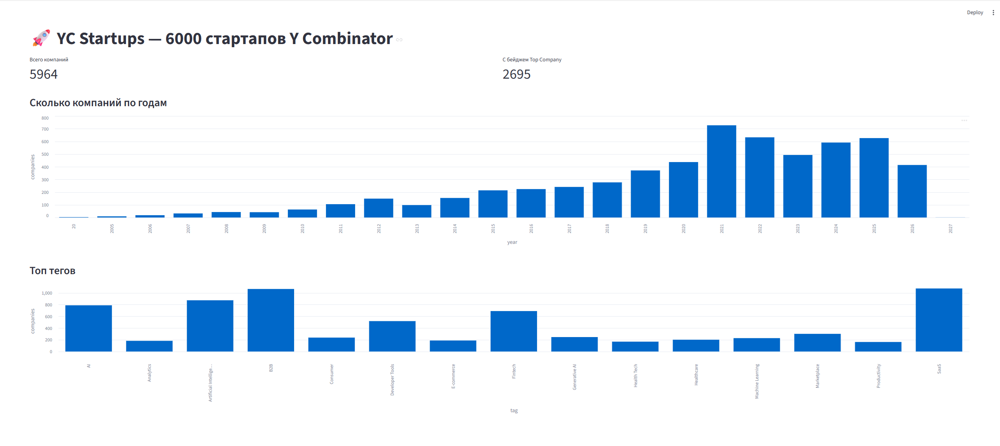

# Пет-проект с аналитикой акселератора Y Combinator

---

### Особенности проекта

- Данные берутся из открытого API https://api.ycombinator.com/v0.1/companies?page=1;
- Пагинация - данные приходят страницами,а не одним большим файлом;
- Объём данных - почти 6000 строк.

---

### Аналитические вопросы
- Из каких индустрий выходит больше всего стартапов и где чаще встречаются топовые компании?
- Как рос Y Combinator по годам - в какие батчи набирали больше всего?
- На какие темы стартапы выстреливали - какие теги встречаются чаще всего?
- Сколько компаний всё ещё активны, сколько закрылось, а сколько вышло на биржу или было куплено?

---
### Процесс запуска

- Создание и запуск контейнера в Docker командой в терминале ```docker run -d --name yc-clickhouse -p 8123:8123 -p 9000:9000 -e CLICKHOUSE_PASSWORD=ycpass clickhouse/clickhouse-server:24.8```
- Запуск 01.fetch.py - постраничное получение данных и их запись в один json-файл
- Запуск 02.load.py - подключение к БД, создание таблицы, подготовка данных из json-файла и загрузка в таблицу
- В 03.analytics.sql содержатся запросы, для  ответа на налитические вопросы
- 04.dasboard.py запускается в терминале из директории проекта командой ```python -m streamlit run 04.dashboard.py```
- В браузере откроется простая визуализация

Результат:

